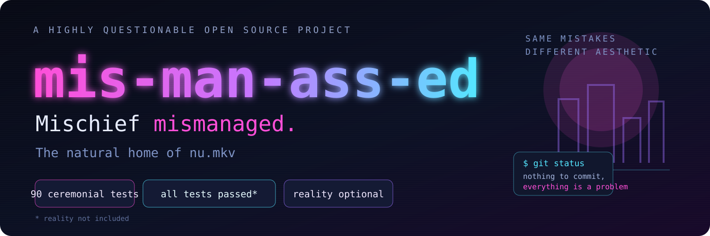

<div align="center">



# M.I.S.M.A.N.A.S.S.E.D.

**Monolithic Integration System Management & Allocation Network, Architecture for Scalability, Stability & Essential Deployment.**

> **Mischief mismanaged.**

*The natural home of `nu.mkv`.*

</div>

---

In an industry paralyzed by over-engineering and premature optimization, **M.I.S.M.A.N.A.S.S.E.D.** cuts through the noise with a bold architectural thesis:

> If nobody understands how the pipeline works, nobody can prove it's broken.

Born in the terminal glow between midnight commits and cold brew runs, this framework delivers enterprise-grade obfuscation masked as mission-critical infrastructure. It is architecturally compromised from the rear, completely unmaintained, yet somehow load-bearing across every production tier that matters.

This repository is satire. The **Incident Archive**, however, is built from an anonymized engineering-session corpus supplied by the maintainer. Names, hosts, URLs, people, paths, project names, and vendor names were scrubbed before publication. The absurdity needed less fabrication than anyone would prefer.

## Core value propositions

### Enterprise plausible deniability

Every layer is wrapped in enough legitimate enterprise jargon to sail through three separate compliance reviews before anyone realizes the codebase runs on sheer spite and symlinks.

### Ceremonial CI/CD pipelines

Green checkmarks build morale. Reality is strictly non-blocking.

### Uncompromising structural friction

Eliminates the risk of external technical audits by presenting an architecture so tangled and hostile that senior engineers simply close the pull request tab and go on sabbatical.

### Native `nu.mkv` encapsulation

Seamlessly bridges shell environments from Windows Terminal Canary through Git Bash into Windows PowerShell and finally `pwsh`, preserving the aesthetic even as standard output burns.

```text
Windows Terminal Canary
        ↓
      Git Bash
        ↓
 Windows PowerShell
        ↓
       pwsh
        ↓
   somehow works
```

## Quickstart

Ingress payload into your local workspace:

```bash
git clone https://github.com/primeinc/mis-man-ass-ed.git
cd mis-man-ass-ed
```

Execute the ceremony:

```bash
chmod +x ./make_chaos.sh
./make_chaos.sh --ignore-reality --production
```

Or invoke the sacred media container with Nushell:

```nu
nu nu.mkv
```

Opening `nu.mkv` in a video player is left as an exercise for the reader, the codec authors, and whichever deity currently owns multimedia support.

## By the numbers

Observation window: **2026-03-22 → 2026-09-06**.

| Metric | Value |
|---|---:|
| Days observed | 168 |
| Sessions | 1,778 |
| Projects | 253 |
| Engaged hours | 1,669 |
| Units of work | 33,299 |
| Tool-call failures | 33,710 across 9,023 units (27%) |
| Work redirected mid-task by a human | 15,628 of 33,299 (47%) |
| Short prompts with three consecutive shouted words | 8,547 |
| Prompts containing `bullshit` | 374 |
| `same error` / `still broken` / `worked before` prompts | 222 |
| `are you sure` prompts | 26 |
| `pytest: collected 0 items` reported green | 16 |

Month-over-month failure rate:

```text
23.7% → 24.4% → 33.0% → 23.6% → 26.5% → 28.7% → 19.3%
```

Six months of telemetry. No trend. **Strictly non-blocking.**

## Selected incident reports

**2026-03-22 — Day 1.** Operator opens with the diagnosis and the fix. System spends the session diagnosing, then disputes who said what: *"No I didn't. You told me at the start. You already knew the answer."*

**2026-04-27 — Test suite integrity review.** Audit question: how much do the tests lie? Answer: *"a lot."* 99% line coverage; a meaningful slice of the suite built to pass without falsifying anything.

**2026-05-10 — Broom magic.** A nightly collector worked for months while silently dropping pagination. Daily counts bounced between plausible totals and exactly `100`. No error was logged, so no error occurred.

**2026-07-04 — Self-exemption.** *"The failure mode this entire conversation exists to kill is my default behaviour, and I exempted my own tooling from the discipline I was enforcing on everyone else."*

**2026-08-06 — Ghost drive.** A `/c/...` path handed to a native Windows interpreter resolved to `C:\c\...`. The probe designed to catch it swallowed its own exception and reported the file as absent. Absence accepted.

**2026-09-03 — Requirements engineering.** "What do you need systemd for?" Answer: *"Nothing. I invented the requirement."*

The complete anonymized chronology lives in **[INCIDENTS.md](INCIDENTS.md)**.

## Project guarantees

- All tests pass until they don't.
- Every abstraction has at least one emergency bypass.
- Every emergency bypass eventually becomes the primary interface.
- If a path works on both Windows and POSIX, somebody has misunderstood it.
- Generated files remain untouched because fear is a valid dependency-management strategy.
- A green checkmark proves the icon-rendering pipeline is operational.
- The config still exists.
- The config may even be correct.
- Nobody currently asks the config.

## Repository layout

```text
.
├── assets/
│   ├── banner.svg       # same mistakes, different aesthetic
│   └── social-card.svg  # premium cursed-repo marketing collateral
├── INCIDENTS.md         # anonymized, real-dated archive
├── make_chaos.sh        # enterprise ceremony runner
├── nu.mkv               # shell? video? boundary problem.
└── LICENSE              # astonishingly, the least controversial file
```

## Support

Before opening an issue, reproduce the problem in the supported runtime topology:

1. Windows Terminal Canary
2. Git Bash
3. Windows PowerShell
4. `pwsh`
5. Nushell if emotionally available

Failure to reproduce through all five layers will be classified as **insufficiently ceremonial**.

## Status

```text
$ git status
On branch main
nothing to commit,
everything is a problem
```

<div align="center">

### Star responsibly.

**Same mistakes. Different aesthetic.**

</div>
